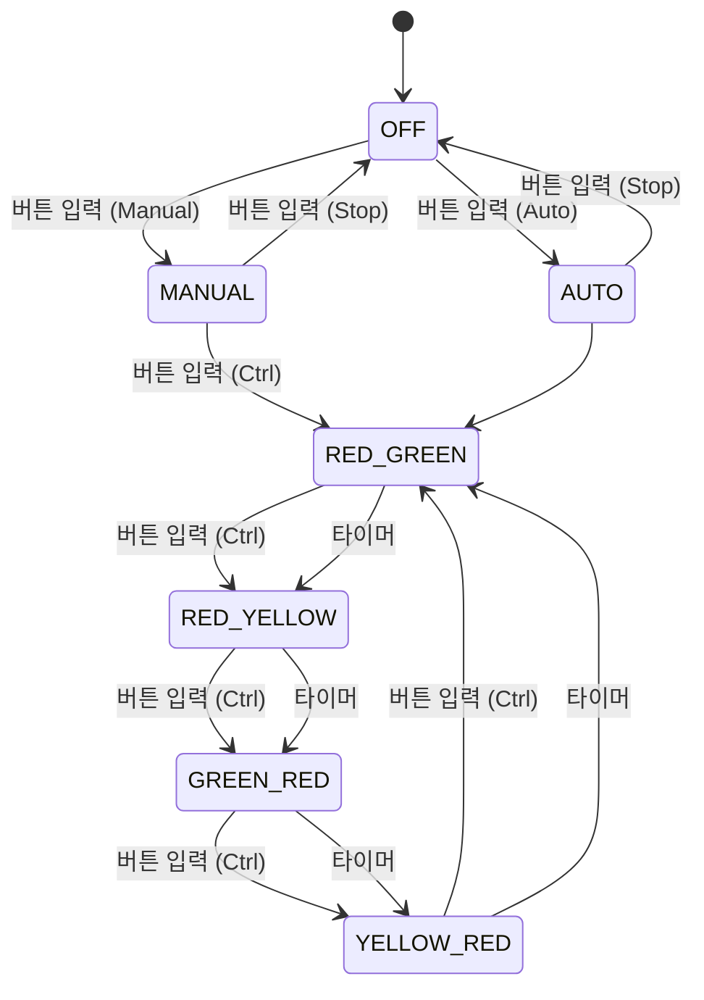

# ATmega128_Smart_TrafficLight

# 🚦 ATmega128 Smart Traffic Light

## 📌 프로젝트 개요

ATmega128 마이크로컨트롤러를 사용한 **4방향 사거리 차량 신호등 시스템**입니다.  
**Manual(수동) 모드**, **Auto(자동) 모드**, **Stop(정지) 모드**를 통해 신호 상태를 제어합니다.  
FSM(Finite State Machine)을 기반으로 설계되었으며, LED를 통해 신호 상태를 표시합니다.

---

## 🛠️ 개발 환경

- **개발 도구:** Microchip Studio
- **프로그래밍 언어:** C
- **사용 마이크로컨트롤러:** ATmega128
- **하드웨어 구성:** LED (적, 황, 녹), 버튼 (3개)

---

## ⚙️ 시스템 동작 원리

## ⚙️ 상태 설명

- **OFF**  
  모든 신호등이 꺼진 상태입니다. 시스템이 대기 모드로 진입합니다.

- **MANUAL**  
  사용자가 버튼을 눌러 신호등 상태를 수동으로 변경할 수 있습니다.

- **AUTO**  
  타이머에 따라 신호등이 자동으로 상태를 변경합니다.

- **RED_GREEN**  
  세로 신호등: 빨간불  
  가로 신호등: 초록불  

- **RED_YELLOW**  
  세로 신호등: 빨간불  
  가로 신호등: 노란불  

- **GREEN_RED**  
  세로 신호등: 초록불  
  가로 신호등: 빨간불  

- **YELLOW_RED**  
  세로 신호등: 노란불  
  가로 신호등: 빨간불  

## ❗ 어려웠던 점 & 해결 방법

1. **타이머 오작동**  
   - **문제:** AUTO 모드에서 타이머가 일정하지 않음.
   - **해결:** 타이머 인터럽트를 사용

2. **버튼 입력 오류**  
   - **문제:** 버튼 입력이 잘못 감지되거나 중복 감지  
   - **해결:** 디바운싱(Debouncing) 사용

3. **LED 상태 지연**  
   - **문제:** 상태 변경 시 지연 발생  
   - **해결:** 불필요한 딜레이를 제거
